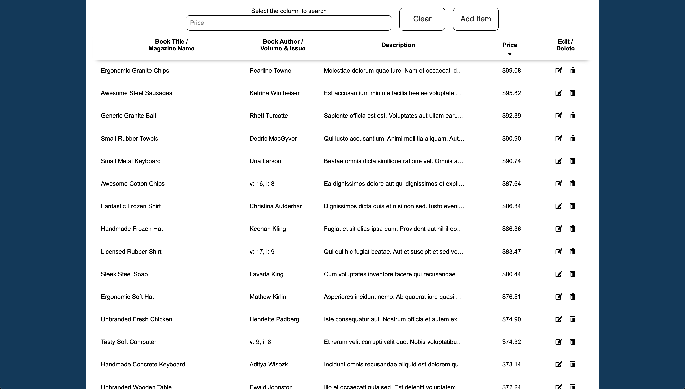
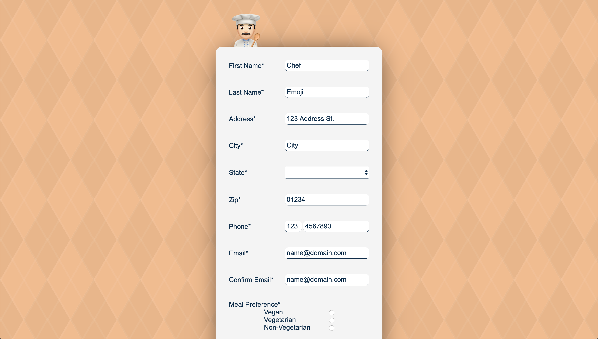

# Books & Magazines

Sort and search CRUD SPA for books and magazines with web accessible forms

## Getting Started

These instructions will get you a copy of the project up and running on your local machine.

### Node and NPM versions used

- Node 10.18.0
- NPM 6.14.4

### Installing

#### NPM packages

- `npm install`

#### Build frontend

- `npm run buildFrontend`

#### Or build and watch frontend

- `npm run watchFrontend`

#### Create a URI.js file
- `cd backend/database`
- `touch URI.js`
- Add the following line:
  - `export const URI = 'mongodb://localhost/<your database name>';`

#### Build backend

- `npm run buildBackend`

#### Or build and watch backend

- `npm run watchBackend`

#### Start with Node

- `npm start`

#### Or start with Nodemon and watch backend

- `npm run startDev`

#### Seed database

- `npm run seed`

## Deployment

- A temporary website can be found on Amazon Web Services:
  - [Books & Magazines](http://ec2-3-23-88-197.us-east-2.compute.amazonaws.com:50000/)
  - NOTE: Only optimized for Google Chrome at this time

- Another example of a form can be found on Netlify
  - [Chef Emoji](https://chef-emoji.netlify.app/)
  - NOTE: Only optimized for Google Chrome at this time
  - NOTE: Submits via email

## Built With

- React
- webpack
- Babel
- Node
- Express
- MongoDB
- Mongoose