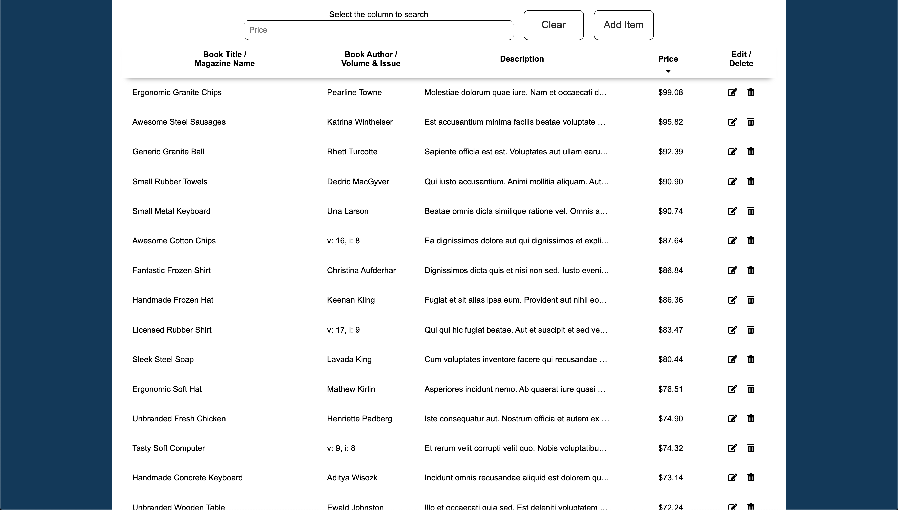

# Books & Magazines

Technical challenge for the Full Stack Engineer position at Level Access.

## Getting Started

These instructions will get you a copy of the project up and running on your local machine.

### Node and NPM versions used

- Node 10.18.0
- NPM 6.14.4

### Installing

#### NPM packages

- `npm install`

#### Build frontend

- `npm run buildFrontend`

#### Build and watch frontend

- `npm run watchFrontend`

#### Build backend

- `npm run buildBackend`

#### Build and watch backend

- `npm run watchBackend`

#### Start with Node

- `npm start`

#### Start with Nodemon and watch backend

- `npm run startDev`

## Deployment

- A temporary website may be found on AWS:
  - [website]()

- Another example of a form can be found on Netlify
  - [Chef Emoji](https://chef-emoji.netlify.app/)

## Built With

- React
- webpack
- Babel
- Node
- Express
- MongoDB
- Mongoose